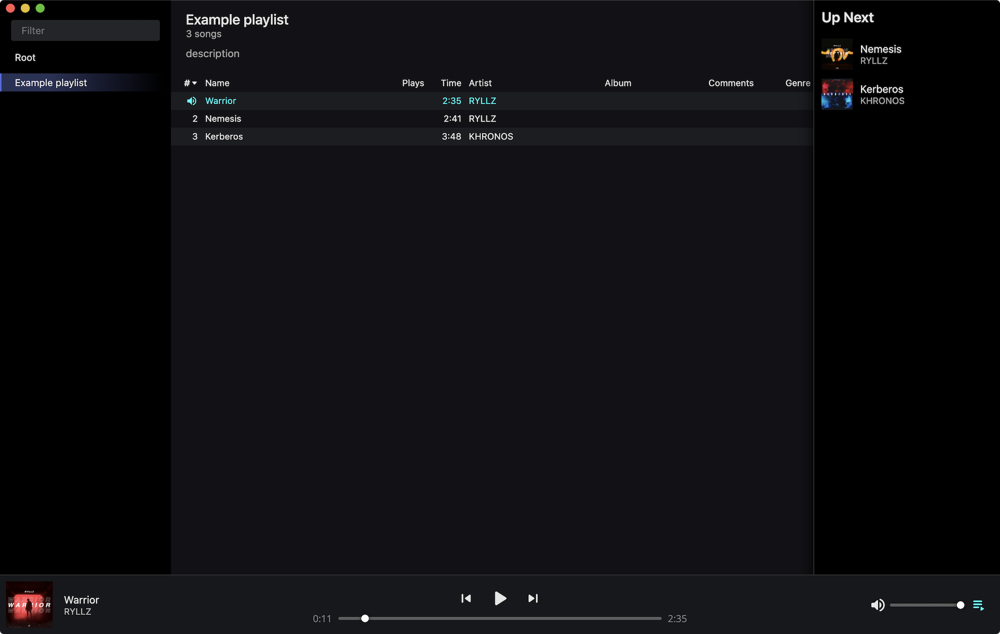

  

<h3 align="center">Ferrum</h3>

  Music library and player
   
  <a href="https://github.com/probablykasper/ferrum/releases"><b>Download for Mac, Windows or Linux</b></a>

## ⚠️ Warning
Ferrum is in development and might get updates that no longer work with your library.

 

## Dev instructions

### ToDo

- Playlist covers
- Move playlists
- Edit playlists
- Create playlist folder
- Allow removing tracks from playlists when filter or sorting is used
- Move iTunes Import to Rust
- iTunes Import overwrites library, but old track files are still kept
- Databases
  - https://github.com/TheNeikos/rustbreak
  - https://github.com/spacejam/sled
  - https://github.com/Owez/tinydb
- Gapless audio
  - https://github.com/RustAudio/rodio
  - https://github.com/regosen/Gapless-5
  - https://github.com/sudara/stitches
  - https://www.npmjs.com/package/gapless.js

### Get started

1. Install Node.js
2. Install Rust
3. Run `npm install`

### Structure

App (Electron)
- Source: `src/electron.js` and `src/electron/`
- Build output: `build/app/`

Web (the frontend)
- Source code: napi and `src/`
- Build output: `build/web/`

Napi (the native Rust backend)
- Source code: `src-native/`
- Build output: `build/addon.node`

### Commands
- `npm run dev`: Start app in dev mode
- `npm run dev-release`: Start app in dev mode (optimized)
- `npm run build`: Build
- `npm run lint`: Lint
- `npm run format`: Format

### Publish new version
1. Run `npm run check`
2. Update `CHANGELOG.md`
3. Run `npm version --no-git-tag <version>` to bump the version number
4. Create a git tag in the format `v#.#.#`
5. Add release notes to the generated GitHub release and publish it
